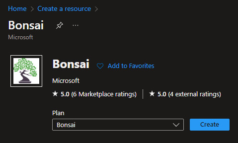
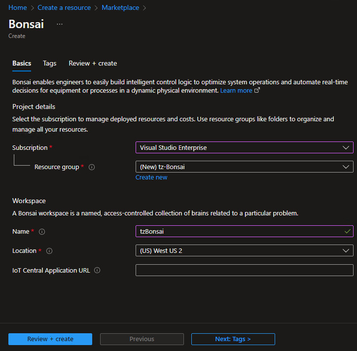
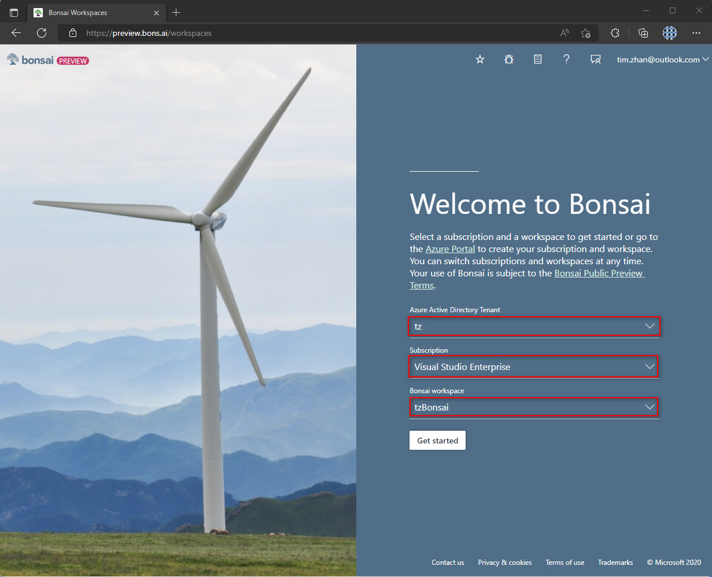

# Lab 1: Set up account for Bonsai

Project Bonsai currently runs on Azure services. To use Bonsai, you must:
- Create (or sign into) a Microsoft or AAD account
- Enable Azure cloud services
- Provision a Bonsai workspace

## Step 1. Create and Provision a Bonsai workspace

On Azure Portal, search `Bonsai` -> click `Create`.

- Subscription: `Visual Studio Enterprise`
- Resource Group: create new `tz-Bonsai`.
- Workspace:
  - Name: `tzBonsai`
  - Location: `West US 2`

## Step 2. Sign in to Bonsai UI

Open Bonsai UI: https://preview.bons.ai/. Select:
- Azure Active Directory Tenant: `tz`
- Susbscription: `Visual Studio Enterprise`
- Bonsai workspace: `tzBonsai`

Click `Get started`.

