# Lab 2: Train AI to Balance a ball

In this lab, we will teach an AI brain to balance a ball in the center of a plate using a custom simulator and sample code.

# 0. Prerequisites

- Lab 1 is completed.
- Moab hardware development kit

# 1. Define the problem

Imagine you are holding a plate and trying to keep a ball balanced in the center.

How would you do it?

**First**, you observe the ball:

- You could track the movement visually.
- You could track the vibrations in the plate by feel.
- You could track the rolling sound.

In observing the ball, you intuitively determine its **current location and speed**.

**Next**, you act on the gathered information:

- If the ball is already in the center, hold the plate flat to keep it there.
- If the ball moves away from the center, adjust the plate angle to move the ball back.

In adjusting the plate angle, you alter its **pitch and roll**.
  
    
## Use the Moab Device to balance the ball

The device has `three arms` powered by `servo motors`. These arms work in tandem to control the angle of the transparent plate to keep the ball balanced.


The Moab device tracks and maps the the ball movement onto a standard `2D coordinate` system. Looking at the front the of the device, the x-axis runs left-to-right, and the y-axis runs front-to-back, with the plate center at location (0, 0), and a radius of r.

The same coordinate system is also used to `define` the two different tilt angles. `Pitch` is the plate angle about the x-axis, `roll` is the plate angle about the y-axis. A perfectly level plate would have pitch and roll of (0, 0).

The trained AI must `learn` how to adjust the plate pitch and roll to balance a ball using the following objectives:

- The ball position (x, y) will reach the plate center at (0, 0) and stay there.
- The ball position will not get near the plate edge at ( | (x, y) - (0, 0) | << r).

Now that you have **identified** the problem and **defined** the objectives, `use machine teaching to train an AI to balance a ball`.

## 2. Create a new brain

Sign into https://preview.bons.ai.

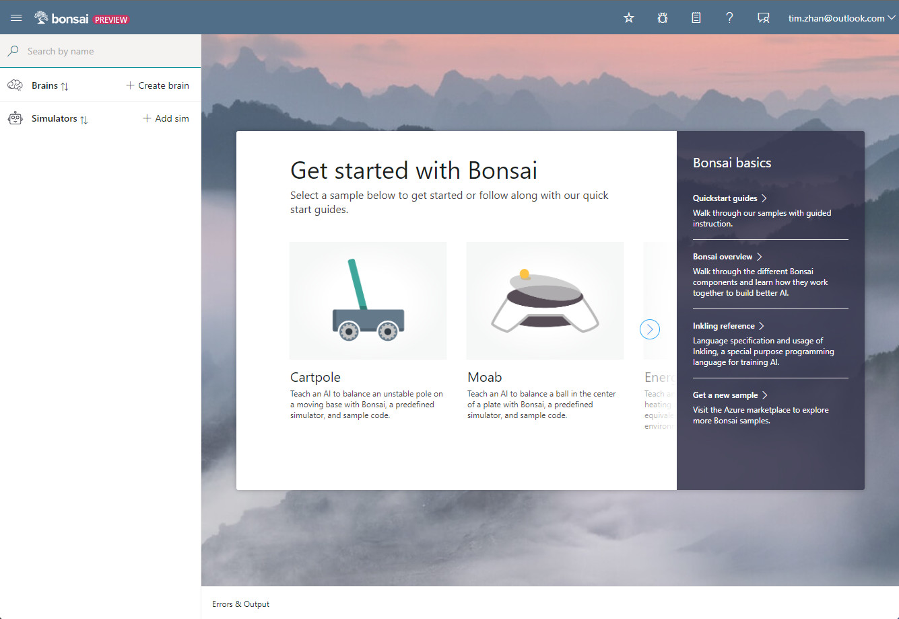

Click `Moab` icon -> Create brain - Add details: `tz-Brain`.

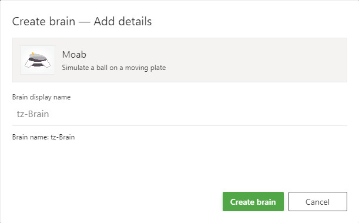


# 3. Inspect the brain

Once created, Bonsai opens the machine teaching interface as below.

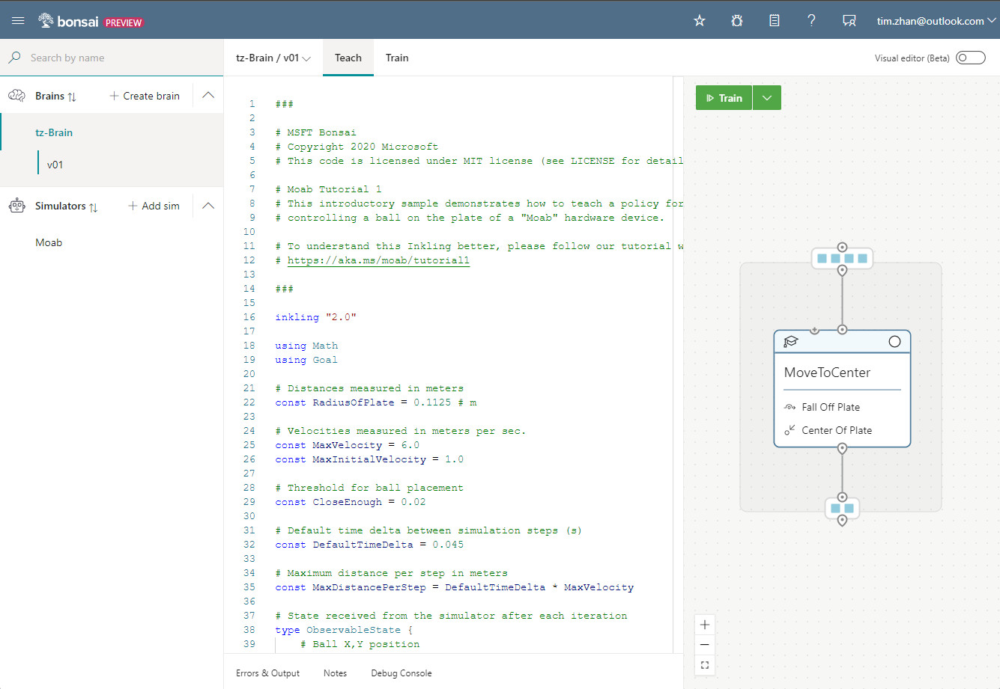

The teaching interface has **three** areas:
- The `Navigation Sidebar` lists all the brains and simulators.
- The `Coding Panel` is the `inkling` code editor. 
  - `Inkling` is a `machine teaching proprietary language`, designed to focus on what you want to teach while handling the AI details for you.
- The `Graphing Panel` displays an interactive, graphical representaion of the observable state, concept, and SimAction currently defined in the coding panel.

## Inspect the state node: ObservableSteate

`ObservableState` defines `what information the brain is sent` during every simulation iteration. For the ball balancing problem, the Moab device tracks the ball `position` and `velocity`. So, your simulation ObservableState is:
- ball_x, ball_y: the (x, y) ball position.
- ball_vel_x, ball_vel_y: the x and y ball velocity components.

```
# State received from the simulator after each iteration
type ObservableState {
    # Ball X,Y position
    ball_x: number<-RadiusOfPlate .. RadiusOfPlate>,
    ball_y: number<-RadiusOfPlate .. RadiusOfPlate>,

    # Ball X,Y velocity
    ball_vel_x: number<-MaxVelocity .. MaxVelocity>,
    ball_vel_y: number<-MaxVelocity .. MaxVelocity>,
}
```
Each state has an associated expected range. In the previous code snippet, the ball_x and ball_y locations are bounded by the plate radius. If provided, ranges can reduce AI training time.

## Inspect the actions node: SimAction

`SimAction` defines `the ways that the brain interacts` with the simulated environment. In your simulation, this is reflected by the following variables:

- **input_pitch**: a value that sets the plate angle along the X axis
  - -1 means tilt all the way forwards (away from the joystick)
  - +1 means tilt all the way backwards (toward the joystick)
- **input_roll**: a value that sets the target plate angle along the Y axis
  - -1 means tilt all the way to the left
  - +1 means tilt all the way to the right

As highlighted before, the Moab device tilts the plate with two `orthogonal angles` (**SimAction**). An onboard algorithm translates this action to the three servo-powered arms, achieving the desired tilt.

```
# Action provided as output by policy and sent as input to the simulator
type SimAction {
    # Range -1 to 1 is a scaled value that represents
    # the full plate rotation range supported by the hardware.
    input_pitch: number<-1 .. 1>, # rotate about x-axis
    input_roll: number<-1 .. 1>, # rotate about y-axis
}
```

## Inspect the concept node: MoveToCenter

The `MoveToCenterconcept` node defines `what the AI should learn`.

A goal describes what you want the brain to learn using one or more objectives (previously defined), as in the following example:

```
# Define a concept graph with a single concept
graph (input: ObservableState) {
    concept MoveToCenter(input): SimAction {
        curriculum {
            # The source of training for this concept is a simulator that
            #  - can be configured for each episode using fields defined in SimConfig,
            #  - accepts per-iteration actions defined in SimAction, and
            #  - outputs states with the fields defined in SimState.
            source simulator (Action: SimAction, Config: SimConfig): ObservableState {
            }
...
```

A `concept` defines what the AI needs to learn and the curriculum is how it learns. Your MoveToCenterconcept will receive simulator states and respond with actions.

# 4 Understand goals

We previously defined two `objectives` for our brain:

- The ball position will not get near the plate edge at ( | (x, y) - (0, 0) | << r).
- The ball position (x, y) will reach the plate center at (0, 0) and stay there.

A goal describes what you want the brain to learn using one or more objectives, as in the following example:

```
# The training goal has two objectives:
#   - don't let the ball fall off the plate 
#   - drive the ball to the center of the plate
goal (State: ObservableState) {
    
    avoid `Fall Off Plate`:
        Math.Hypot(State.ball_x, State.ball_y) in Goal.RangeAbove(RadiusOfPlate * 0.8)

    drive `Center Of Plate`:
        [State.ball_x, State.ball_y] in Goal.Sphere([0, 0], CloseEnough)
}
```

As the brain trains, it attempts to simultaneously meet all the defined objectives during each episode.

Available goal objectives include:

- avoid: Avoid a defined region.
- drive: Get to a target as quickly as possible and stay in that place.
- reach: Get to a target as quickly as possible.

## Objective: Avoid falling off the plate
To teach the brain to keep the ball on the plate, use avoid to define an objective called Fall Off Plate, as in the following code snippet:

```
avoid `Fall Off Plate`:
    Math.Hypot(State.ball_x, State.ball_y) in Goal.RangeAbove(RadiusOfPlate * 0.8)
```

An avoid objective asks the brain to learn to avoid a certain region of states. Your objective states that the ball's distance from the center must not reach values above 80% of the plate radius. This will teach the brain to keep the ball on the plate.

## Objective: Move the ball to the center of the plate
To teach the brain to move the ball to a specific spot and keep it there, use drive to define a objective called Center Of Plate, as in the following code snippet:

```
drive `Center Of Plate`:
    [State.ball_x, State.ball_y] in Goal.Sphere([0, 0], CloseEnough)
```

A drive objective asks the brain to learn to reach to a target as soon as possible and stay there. In this case, the target is for the ball's X and Y coordinates (state.ball_x and state.ball_y) to stay within CloseEnough radial distance from the plate center.

# 5. Train the brain

Click Train button to start the training.

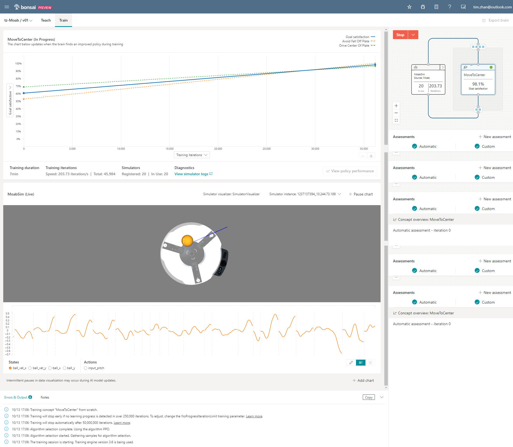

Once completed, you will see something like this:

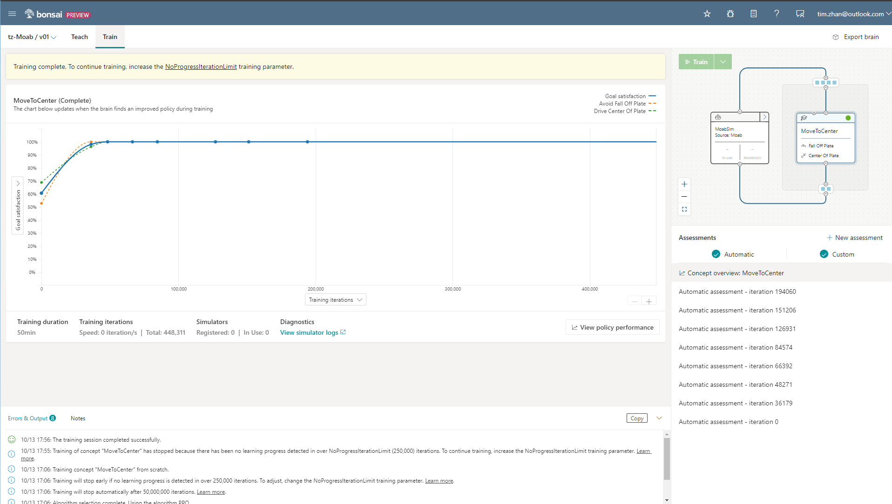


# 6. Export brain

On the top-right of the Bonsai UI, click `Export brain` -> Processor architecture: Linux -> `Arm32v7` -> Click `Export`.

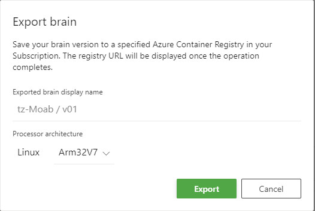

Once exported, you may view the `Deployment instructions`.

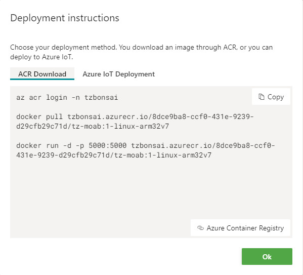


Here are two ways to deploy the brain to the moab.

## Use ACR download
Follow below scripts

```
az acr login -n tzbonsai

docker pull tzbonsai.azurecr.io/8dce9ba8-ccf0-431e-9239-d29cfb29c71d/tz-moab:1-linux-arm32v7

docker run -d -p 5000:5000 tzbonsai.azurecr.io/8dce9ba8-ccf0-431e-9239-d29cfb29c71d/tz-moab:1-linux-arm32v7
```

## Use Azure IoT
You may need to install Azure IoT Edge runtime on Moab first.

dock
```
"modules": {
    "Bonsai": {
        "version": "1.0",
        "type": "docker",
        "status": "running",
        "restartPolicy": "always",
        "settings": {
            "image":"tzbonsai.azurecr.io/8dce9ba8-ccf0-431e-9239-d29cfb29c71d/tz-moab:1-linux-arm32v7",
            "createOptions": "{\"HostConfig\":{\"PortBindings\":{\"5000/tcp\":[{\"HostPort\":\"5005\"}]}},\"ExposedPorts\":{\"5000/tcp\":{}}}"
        }
    }
}
```

# 7. Download brain to Moab

## 7.1 SSH into Moab

Login to Moab(RPi4) using SSH.

```
ssh pi@moab
```

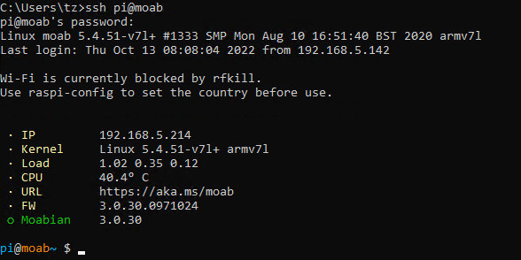

## 7.2 Sign in to Docker
Azure CLI is not supported on ARM device, so Azure CLI cannot run here even if it seems to be installed successfully.

Sign in to Docker using Azure Container Registry credentials that you created in Step 6.

```
docker login -u tzbonsai tzbonsai.azurecr.io
```
Here you are prompted to enter the password, you should go to `Azure Portal` -> `Container Registries` -> `Access keys` -> `Password`, note the password, and then enter it here.

`h+WeuCDI92QGXfW7Hh7VKrc0GwEt+1vi`


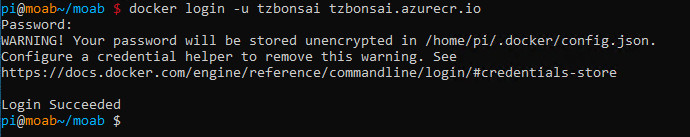

## 7.3 Download the container

```
docker pull tzbonsai.azurecr.io/8dce9ba8-ccf0-431e-9239-d29cfb29c71d/tz-moab:1-linux-arm32v7
```

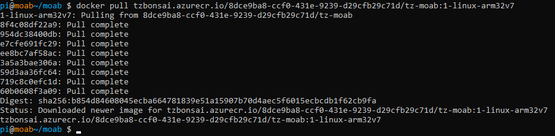

# 8. Run the brain

## 8.1 List containers

Firstly, verify the running containers.
```
docker ps
```

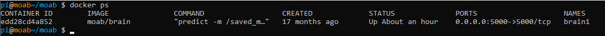

You may also use below command to show the containers downloaded on the Moab.

```
docker ps -a
```
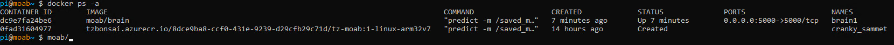

As you may have noticed, the imager named `moab/brain` is the pre-loaded one, the image named `tz-moab` is the one I trained and downloaded in previous steps.

## 8.2 Stop the existing container

```
down
docker ps
```
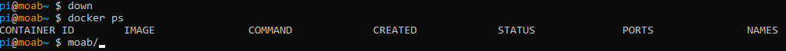

## 8.3 Run a new container

You may select the preloaded `brain1` to run or run the new container you trained.

To run the pre-loaded one, just enter command:

```
up
```

To run a new container, use `docker run` command.

```
docker run -d -p 5000:5000 tzbonsai.azurecr.io/8dce9ba8-ccf0-431e-9239-d29cfb29c71d/tz-moab:1-linux-arm32v7
```
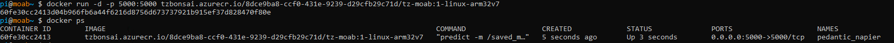


## 8.4 Start to use the brain

On the moab, there is a small control panel with three buttons and one small LED screen.

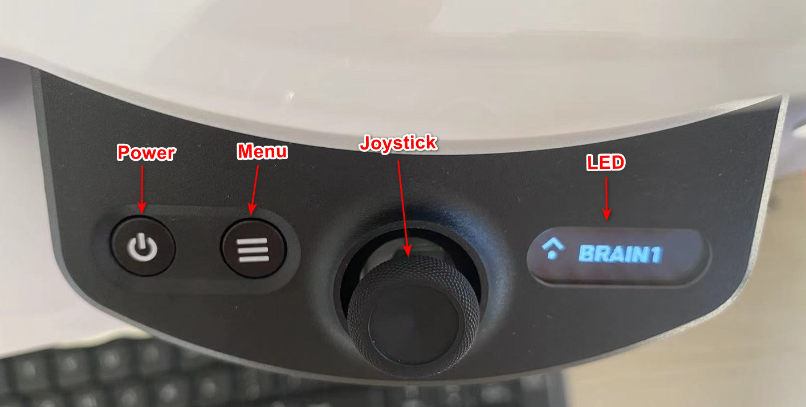

Press `Menu`. By default, it shows `CALLIBRATE`. Control the `Joystick` to press down `3 times` until it shows `BRAIN1`. Then press the Joystick to select it, and you will notice the `servo arms` are stretched in working mode.

Here is a comparision of switching from config mode to working mode.

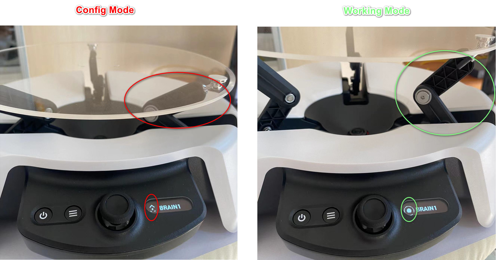

Now you may put the the ball on the plate to start the brain learning.

In the beginning, the ball is easy to fall off the place. As the brain keeps learning, you will be noticing that the moab bot can hold the ball quite well and the falling off times become less and less.

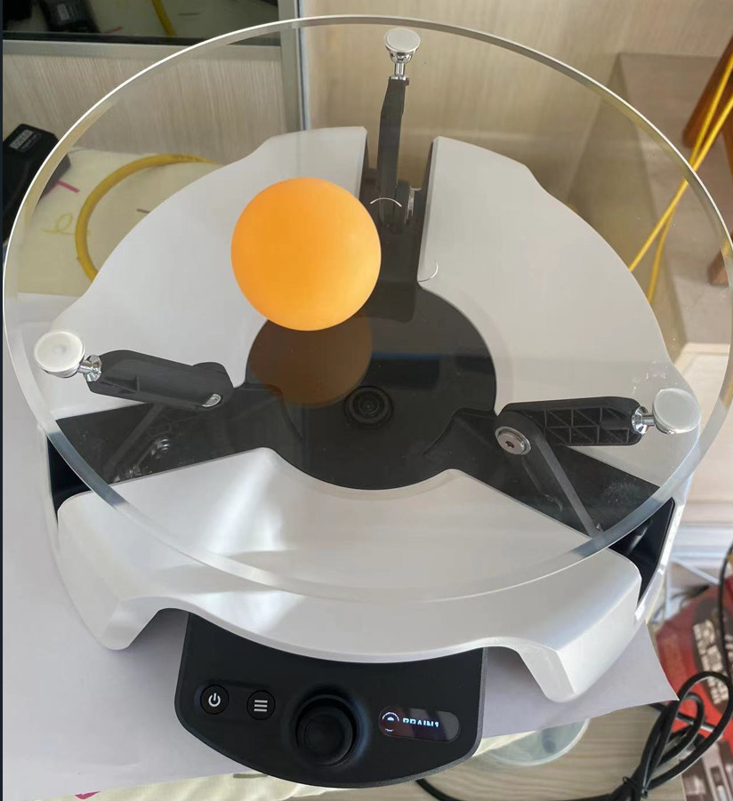


`<END of Lab2>`
