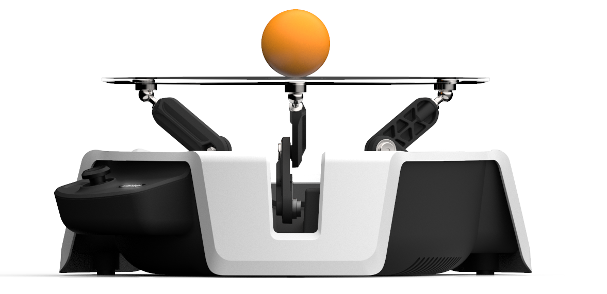
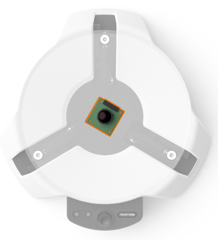
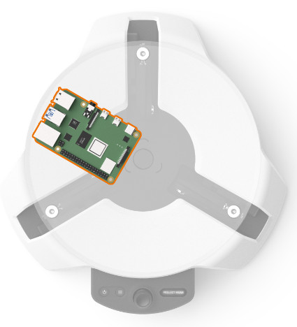
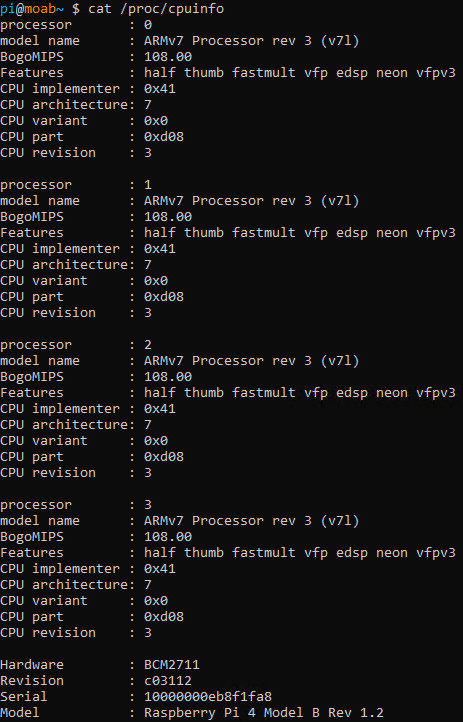
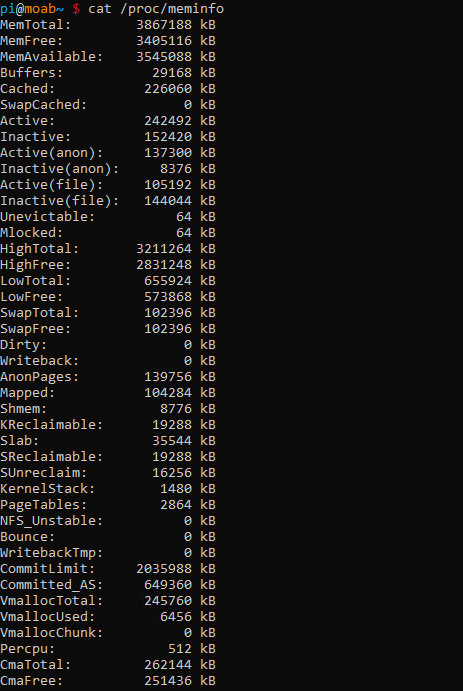
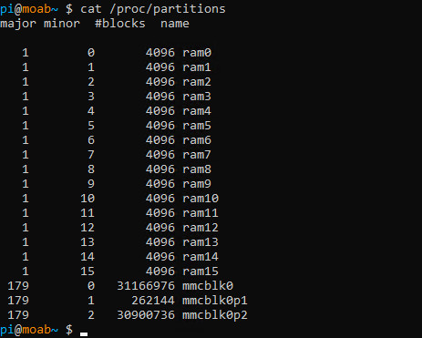
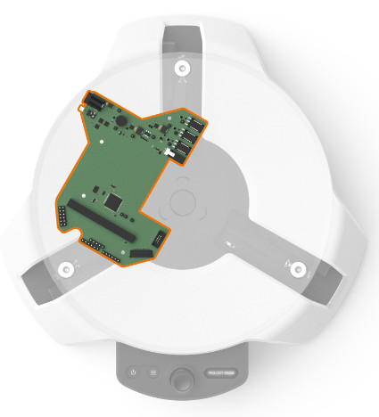
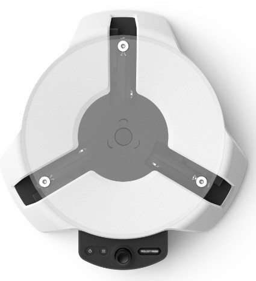
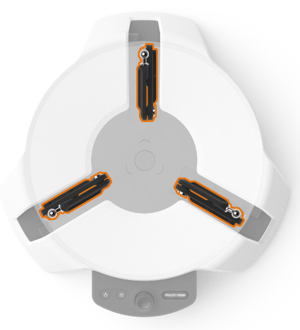
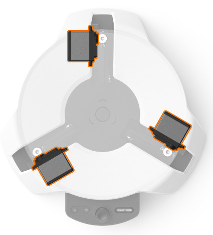

# README

`Project Moab` is a `Machine Teaching Hardware Kit` or a bot for `Autonomous Systems` from Microsoft.

**Microsoft Project Moab** is a fully integrated system for users of all levels to `learn` and `explore` building autonomous intelligent controls using `reinforcement learning` through `Project Bonsai`'s `Machine Teaching platform`. 

The device has `three arms` powered by `servo motors`. These arms work in tandem to control the angle of the transparent plate to keep the ball balanced.



# Moab Components and Features

The bot uses a variety of sensors and components to balance objects.

- **Camera module**

  

- **Raspberry Pi 4B**
  
  

  If you want to find out the hardware details of RPi4, you can run below scripts:

  ```
  # Get the CPU, RAM and Partitions
  cat /proc/cpuinfo
  cat /proc/meminfo
  cat /proc/partitions
  ```
  
  
    

- **Power & Control board**
  
  

- **UI Board**
  
  


- **Control arms**
  
  


- **Servos**
  
  

---


Here I followed the tutorials from Github to do a few hands-on labs.


# Machine Teaching with Bonsai and Moab

## [Lab 1: Set up environment for Bonsai](Lab1-Set_Up_account_for_Bonsai.md)

## [Lab 2. Balance a ball on a virutal Moab](Lab2-Train_AI_to_Balance_A_Ball.md)

Get started with the Bonsai platform by learning how to teach an AI to balance a ball in the center of the Moab bot's plate.


## Lab 3. Robust Blancing with Domain Randomization
Learn to bridge the simulation-to-real-world gap by using Domain Randomization. By varying the AI's training environment, you will teach a brain that works better on real hardware.

## Lab 4. Avoid Obstacles

Go beyond single-objective controllers by teaching an AI to balance the ball in the center while avoiding an obstacle.


`<END of README>`